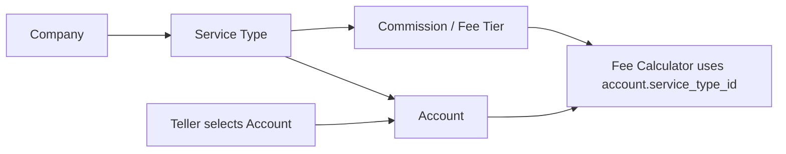

# Teller Companies / Service Types / Fees Calculation

ဤစာတမ်းသည် Teller transaction screens များတွင် Companies, Service Types, Fees များကို အခြေခံပြီး fee calculation ဘယ်လိုတွက်နေသည်ကို ရှင်းပြထားသည်။ အထူးသဖြင့် Cash Out တွင် `0.2` ထားသော်လည်း Fee `100 MMK` ပဲထွက်နေသည့် case ကိုပါ သီးသန့်ရှင်းပြထားသည်။

## Data Relationship

စနစ်ထဲတွင် fee calculation သည် account ကို တိုက်ရိုက်မသတ်မှတ်ဘဲ account နှင့်ချိတ်ထားသော Service Type ကိုအခြေခံသည်။



အဓိကချိတ်ဆက်ပုံ:

- Company တစ်ခုတွင် Service Types များရှိသည်။
- Service Type တစ်ခုတွင် Accounts များရှိသည်။
- Fee / Commission Tier သည် Service Type တစ်ခုနှင့်ချိတ်ထားသည်။
- Teller က transaction လုပ်ရာတွင် account ကိုရွေးသည်။
- ရွေးထားသော account ၏ `service_type_id` ဖြင့် active fee tier ကိုရှာပြီး fee တွက်သည်။

ဥပမာ `Hla Naing` account သည် `KBZPay / Kpay` Service Type နှင့်ချိတ်ထားပါက Cash Out fee သည် ထို Service Type ၏ Fee tier ကိုသုံးသည်။

## Fee Lookup Rule

Fee tier ရှာသည့်အခါ transaction amount သည် active tier range ထဲတွင်ရှိရမည်။

```text
amount_from <= amount <= amount_to
```

Range ထဲမဝင်ပါက fee သည် `0.00` ဖြစ်နိုင်သည်။ Active tier မဟုတ်ပါကလည်း သုံးမည်မဟုတ်ပါ။

Transaction type အလိုက် field သုံးပုံ:

| Transaction | Fee field | Commission direction |
| --- | --- | --- |
| Cash In | `fee_amount_deposit` | `comm_deposit` |
| Cash Out | `fee_amount_withdraw` | `comm_withdraw` |
| Transfer | transfer reference account ၏ Cash In fee path | receive/payout account အလိုက် |

Cash Out တွင် Teller ရွေးထားသော account ၏ Service Type tier မှ `fee_amount_withdraw` ကိုသုံးသည်။

Transfer တွင် flow နှစ်မျိုးရှိသည်:

- Normal account-to-account transfer ဖြစ်လျှင် source account ကို fee reference အဖြစ်သုံးသည်။
- Customer transfer fields ပါလျှင် system receive account ကို fee reference အဖြစ်သုံးသည်။

## Teller Cash In / Cash Out Calculation From Tier

Teller အတွက် Cash In နှင့် Cash Out နှစ်ခုစလုံးသည် အရင်ဆုံးရွေးထားသော account မှ Service Type ကိုယူသည်။ ထို့နောက် ထို Service Type ၏ active tier ကို amount range ဖြင့်ရှာသည်။

```text
selected account -> account.service_type_id
service_type_id + amount -> active commission_tier
commission_tier fields -> fee calculation
```

Commission တွက်ရာတွင် account သည် agent account ဖြစ်ရမည်။ Admin Accounts setup တွင် `Agent Account` (`is_agent`) ကို check မထားပါက tier ထဲတွင် `comm_deposit` / `comm_withdraw` တန်ဖိုးရှိနေလည်း commission သည် `0.00 MMK` ဖြစ်သည်။

```text
if account.is_agent == false:
    commission = 0
else:
    commission = tier commission calculation
```

### Cash In Calculation

Cash In တွင် teller ရွေးထားသော account ကို source account အဖြစ်ယူပြီး ထို account ၏ Service Type tier ကိုသုံးသည်။

Tier မှသုံးသော fields:

| Purpose | Tier field |
| --- | --- |
| Base fee | `fee_amount_deposit` |
| Additional fee | `additional_fee_deposit_amount` |
| Commission | `comm_deposit` |
| Fee type | `fee_amount_type` |
| Additional fee type | `additional_fee_type` |
| Commission type | `comm_type` |

Formula:

```text
base_fee =
  if fee_amount_type == FIXED:
      fee_amount_deposit
  if fee_amount_type == PERCENTAGE:
      amount * (fee_amount_deposit / 100)

additional_fee =
  if additional_fee_type == FIXED:
      additional_fee_deposit_amount
  if additional_fee_type == PERCENTAGE:
      amount * (additional_fee_deposit_amount / 100)

customer_fee = roundMmkFee(base_fee + additional_fee)

commission =
  if comm_type == FIXED:
      comm_deposit
  if comm_type == PERCENTAGE:
      amount * (comm_deposit / 100)
```

Cash In transaction service ထဲတွင် customer fee နှင့် commission ကိုတွက်ပြီး account balance debit / commission credit / fee account handling များကို ဆက်လုပ်သည်။
သို့သော် selected account သည် `Agent Account` မဟုတ်ပါက commission credit မလုပ်ပါ။

### Cash Out Calculation

Cash Out တွင် teller ရွေးထားသော account ကို credit account အဖြစ်ယူပြီး ထို account ၏ Service Type tier ကိုသုံးသည်။

Tier မှသုံးသော fields:

| Purpose | Tier field |
| --- | --- |
| Base fee | `fee_amount_withdraw` |
| Additional fee | `additional_fee_withdraw_amount` |
| Commission | `comm_withdraw` |
| Fee type | `fee_amount_type` |
| Additional fee type | `additional_fee_type` |
| Commission type | `comm_type` |

Formula:

```text
base_fee =
  if fee_amount_type == FIXED:
      fee_amount_withdraw
  if fee_amount_type == PERCENTAGE:
      amount * (fee_amount_withdraw / 100)

additional_fee =
  if additional_fee_type == FIXED:
      additional_fee_withdraw_amount
  if additional_fee_type == PERCENTAGE:
      amount * (additional_fee_withdraw_amount / 100)

customer_fee = roundMmkFee(base_fee + additional_fee)

commission =
  if comm_type == FIXED:
      comm_withdraw
  if comm_type == PERCENTAGE:
      amount * (comm_withdraw / 100)
```

Cash Out transaction service ထဲတွင် customer receives amount သည် transaction amount ဖြစ်ပြီး, fee payment method သည် account ဖြစ်ပါက credited account balance တွင် `amount + customer_fee + commission` သက်ရောက်နိုင်သည်။ Fee payment method သည် cash ဖြစ်ပါက account balance credit တွင် fee မပေါင်းဘဲ `amount + commission` ကိုသုံးသည်။
သို့သော် selected account သည် `Agent Account` မဟုတ်ပါက commission သည် `0.00` ဖြစ်သောကြောင့် balance credit ထဲတွင် commission မပေါင်းပါ။

### Cash In / Cash Out Field Difference

တူညီသော tier row တစ်ခုထဲတွင် Cash In နှင့် Cash Out အတွက် fee values ကို column ခွဲထားသည်။

```text
Cash In  -> deposit columns
Cash Out -> withdraw columns
```

ထို့ကြောင့် Admin Fees table တွင်:

```text
Fee IN / OUT: FIXED / 0.1 / 0.2
```

ဆိုပါက:

- Cash In fee value သည် `0.1`
- Cash Out fee value သည် `0.2`
- နှစ်ခုလုံး၏ type သည် `FIXED`
- `0.1` နှင့် `0.2` သည် MMK amount ဖြစ်ပြီး percent မဟုတ်ပါ

## Calculation Behavior

Fee type နှစ်မျိုးရှိသည်။

### FIXED

`FIXED` ဆိုသည်မှာ input value ကို MMK amount အဖြစ် တိုက်ရိုက်ယူသည်။ Percent မဟုတ်ပါ။

ဥပမာ:

```text
fee_amount_withdraw = 200
amount = 100,000
raw fee = 200 MMK
```

`FIXED 0.2` ဆိုသည်မှာ `0.2 MMK` ဖြစ်သည်။ `0.2%` မဟုတ်ပါ။

### PERCENTAGE

`PERCENTAGE` ဆိုသည်မှာ amount နှင့်မြှောက်တွက်သည်။

လက်ရှိ backend semantics:

```text
1 = 1%
0.2 = 0.2%
0.1 = 0.1%
```

ဥပမာ:

```text
amount = 210,000
fee_amount_withdraw = 0.2
type = PERCENTAGE
raw fee = 210,000 * (0.2 / 100) = 420 MMK
```

သတိပြုရန်: Admin UI တွင် `PERCENTAGE 0.2` ထည့်ပါက `0.2%` အဖြစ်တွက်သည်။

## MMK Fee Rounding

Final customer fee သည် `Money::roundMmkFee()` ဖြင့် rounding လုပ်သည်။

Rule:

- Raw fee `<= 0` ဖြစ်လျှင် `0`
- Raw fee ရှိလျှင် minimum fee `100 MMK`
- 100 အလိုက် floor လုပ်ပြီး remainder ကိုစစ်သည်
- remainder `<= 20` ဖြစ်လျှင် အောက်သို့ round
- remainder `> 20` ဖြစ်လျှင် အပေါ်သို့ round

ဥပမာ:

| Raw fee | Final fee |
| ---: | ---: |
| `0.2` | `100` |
| `20` | `100` |
| `120` | `100` |
| `120.1` | `200` |
| `199.99` | `200` |
| `420` | `400` |
| `420.1` | `500` |

ထို့ကြောင့် `PERCENTAGE 0.2` ဖြင့် Cash Out `210,000` တွက်ပါက raw fee `420` ဖြစ်ပြီး final fee သည် `400 MMK` ဖြစ်သည်။ `420` ၏ remainder သည် `20` ဖြစ်သောကြောင့် အောက်သို့ round လုပ်သည်။

## Cash Out `0.2` Case

Screenshot ထဲတွင် Admin Fees table က ဤပုံစံဖြစ်နေသည်။

```text
Range: 1 - 999,999,999
Fee IN / OUT: FIXED / 0.1 / 0.2
Comm. IN / OUT: FIXED / 0 / 0
Add. IN / OUT: FIXED / 0 / 0
```

ဤအခြေအနေတွင် Cash Out fee calculation သည် အောက်ပါအတိုင်းဖြစ်သည်။

```text
type = FIXED
cash out fee value = 0.2
raw fee = 0.2 MMK
final fee after MMK rounding = 100 MMK
```

အဓိပ္ပါယ်:

- `0.2` ကို `0.2%` အဖြစ်မယူပါ။
- `FIXED` ဖြစ်သောကြောင့် `0.2 MMK` အဖြစ်ယူသည်။
- `0.2 MMK` သည် positive fee ဖြစ်သောကြောင့် minimum rounding ဖြင့် `100 MMK` ဖြစ်သည်။
- ထို့ကြောင့် amount `100,000` ဖြစ်ဖြစ် `210,000` ဖြစ်ဖြစ် fee သည် `100 MMK` ဖြစ်နိုင်သည်။

ဤ case သည် `0.1` နှုန်းဖြင့် Cash Out တွက်နေခြင်းမဟုတ်ပါ။ `FIXED 0.2` ကို minimum fee rounding လုပ်ထားခြင်းဖြစ်သည်။

## Correct Setup Examples

### Fixed amount fee လိုချင်လျှင်

Cash Out fee ကို `200 MMK` အမြဲယူချင်လျှင်:

```text
Fee Type = FIXED
Cash Out Fee = 200
```

Result:

```text
amount = 100,000
fee = 200 MMK

amount = 210,000
fee = 200 MMK
```

### Percentage fee လိုချင်လျှင်

Cash Out fee ကို `0.2%` ယူချင်လျှင်:

```text
Fee Type = PERCENTAGE
Cash Out Fee = 0.2
```

Result examples:

```text
amount = 100,000
raw fee = 100,000 * (0.2 / 100) = 200
final fee = 200 MMK

amount = 210,000
raw fee = 210,000 * (0.2 / 100) = 420
final fee = 400 MMK
```

`210,000` တွင် final fee `400 MMK` ဖြစ်ရခြင်းမှာ MMK rounding rule အရ `420` ၏ remainder `20` ကို အောက်သို့ round လုပ်သောကြောင့်ဖြစ်သည်။

## Manual Verification Checklist

Admin Fees setup ပြောင်းပြီး Teller Cash Out screen တွင် အောက်ပါ scenarios များဖြင့်စစ်နိုင်သည်။

| Setup | Amount | Expected result |
| --- | ---: | ---: |
| `FIXED 200` | `100,000` | `200 MMK` |
| `FIXED 0.2` | `100,000` | `100 MMK` |
| `FIXED 0.2` | `210,000` | `100 MMK` |
| `PERCENTAGE 0.2` | `100,000` | `200 MMK` |
| `PERCENTAGE 0.2` | `210,000` | `400 MMK` |

စစ်ရာတွင် Admin Fees table တွင် Service Type မှန်ကြောင်း၊ Teller Cash Out တွင် ရွေးထားသော account သည် ထို Service Type နှင့်ချိတ်ထားကြောင်း အရင်စစ်ပါ။

## Related Code Paths

အရေးကြီးသော backend paths:

- `app/Services/TransactionFeeCalculator.php`
  - Fee tier lookup
  - `FIXED` / `PERCENTAGE` calculation
  - Cash In / Cash Out fee column selection
  - `is_agent` မဟုတ်သော account အတွက် commission ကို `0.00` ပြန်ပေးခြင်း
- `app/Support/Money.php`
  - MMK fee rounding
  - Minimum `100 MMK` rule
- `app/Services/TransactionService.php`
  - Cash Out transaction creation
  - Teller selected account မှ calculator သို့ fee calculation ခေါ်ခြင်း

အရေးကြီးသော frontend/admin path:

- `resources/js/components/admin/operations/AdminOperationsPage.vue`
  - Admin Fees create/edit/list UI
  - Fee Type နှင့် Cash In / Cash Out fee values ပြသခြင်း

## Assumptions

- ဤစာတမ်းသည် ပြင်ပြီးသား calculator behavior ကိုရှင်းပြရန်ဖြစ်သည်။
- `PERCENTAGE` calculation တွင် Admin ထည့်သည့် human percentage value ကို `value / 100` ဖြင့်တွက်သည်။
- Admin UI တွင် `PERCENTAGE 0.2` ကို `0.2%` အဖြစ် တိုက်ရိုက်တွက်သည်။
